# 🏗️ DIAGRAMA DE ARQUITECTURA - AGENCIA VASIR

```mermaid
graph TB
    %% CAPA DE PRESENTACIÓN
    subgraph "🌐 FRONTEND - Vue.js 3 + Inertia.js"
        A1[🏠 Página Inicio]
        A2[🏨 Tours Nacionales]
        A3[✈️ Tours Internacionales]
        A4[🛍️ Tienda Virtual]
        A5[👤 Área Cliente]
        A6[⚙️ Panel Admin]
        A7[📊 Dashboard Analytics]
        A8[🛒 Carrito Compras<br/>Pinia Store]
    end

    %% CAPA DE APLICACIÓN
    subgraph "⚡ MIDDLEWARE - Inertia.js Bridge"
        B1[🔄 HandleInertiaRequests]
        B2[🔐 Autenticación Middleware]
        B3[👑 Roles & Permisos]
        B4[🛡️ CORS Handler]
    end

    %% CAPA DE LÓGICA DE NEGOCIO
    subgraph "🎯 BACKEND - Laravel 12 Controllers"
        C1[🏨 TourController<br/>CRUD Tours + Reservas]
        C2[🛍️ ProductoController<br/>Tienda + Inventario]
        C3[🏨 HotelController<br/>Gestión Alojamientos]
        C4[✈️ AerolineaController<br/>Gestión Aerolíneas]
        C5[📋 ReservaController<br/>Sistema Bookings]
        C6[💰 VentaController<br/>Procesamiento Pagos]
        C7[👥 ClienteController<br/>CRM Clientes]
        C8[⚙️ SettingsController<br/>Configuraciones]
        C9[📊 InformePDFController<br/>Reportes]
        C10[💾 BackupController<br/>Respaldos]
    end

    %% CAPA DE DATOS
    subgraph "🗃️ MODELOS - Eloquent ORM"
        D1[(Tour)]
        D2[(Producto)]
        D3[(Hotel)]
        D4[(Aerolinea)]
        D5[(Reserva)]
        D6[(Cliente)]
        D7[(User)]
        D8[(Venta)]
        D9[(Inventario)]
        D10[(SiteSetting)]
    end

    %% BASE DE DATOS
    subgraph "🏦 DATABASE - Railway MySQL"
        E1[(🏨 tours)]
        E2[(🛍️ productos)]
        E3[(🏨 hoteles)]
        E4[(✈️ aerolineas)]
        E5[(📋 reservas)]
        E6[(👥 clientes)]
        E7[(👤 users)]
        E8[(💰 ventas)]
        E9[(📦 inventarios)]
        E10[(⚙️ site_settings)]
        E11[(🏢 company_values)]
        E12[(📦 paquetes)]
    end

    %% SISTEMA DE ARCHIVOS
    subgraph "📁 STORAGE - Laravel Storage System"
        F1[📂 storage/app/public/tours/]
        F2[📂 storage/app/public/productos/]
        F3[📂 storage/app/public/hoteles/]
        F4[📂 storage/app/public/aerolinea/]
        F5[🔗 public/storage → symlink]
    end

    %% SERVICIOS EXTERNOS
    subgraph "☁️ CLOUD SERVICES"
        G1[🚀 Render<br/>Web Hosting]
        G2[🛤️ Railway<br/>MySQL Database]
        G3[📧 Email Service]
        G4[🔐 SSL Certificate]
    end

    %% HERRAMIENTAS DE BUILD
    subgraph "🛠️ BUILD TOOLS"
        H1[📦 Vite<br/>Asset Bundling]
        H2[🎨 TailwindCSS<br/>Styling]
        H3[🧩 PrimeVue<br/>UI Components]
        H4[📊 Chart.js<br/>Analytics]
    end

    %% CONEXIONES PRINCIPALES
    A1 --> B1
    A2 --> B1
    A3 --> B1
    A4 --> B1
    A5 --> B1
    A6 --> B1
    A7 --> B1
    A8 --> B1

    B1 --> B2
    B2 --> B3
    B3 --> B4

    B4 --> C1
    B4 --> C2
    B4 --> C3
    B4 --> C4
    B4 --> C5
    B4 --> C6
    B4 --> C7
    B4 --> C8
    B4 --> C9
    B4 --> C10

    C1 --> D1
    C2 --> D2
    C3 --> D3
    C4 --> D4
    C5 --> D5
    C6 --> D8
    C7 --> D6
    C8 --> D10

    D1 --> E1
    D2 --> E2
    D3 --> E3
    D4 --> E4
    D5 --> E5
    D6 --> E6
    D7 --> E7
    D8 --> E8
    D9 --> E9
    D10 --> E10

    C1 --> F1
    C2 --> F2
    C3 --> F3
    C4 --> F4

    E1 --> G2
    E2 --> G2
    E3 --> G2
    E4 --> G2
    E5 --> G2

    G1 --> G4
    G2 --> G3

    H1 --> A1
    H2 --> A1
    H3 --> A1
    H4 --> A7

    %% ESTILOS
    classDef frontend fill:#e1f5fe,stroke:#01579b,stroke-width:2px
    classDef middleware fill:#f3e5f5,stroke:#4a148c,stroke-width:2px
    classDef backend fill:#e8f5e8,stroke:#1b5e20,stroke-width:2px
    classDef database fill:#fff3e0,stroke:#e65100,stroke-width:2px
    classDef storage fill:#fce4ec,stroke:#880e4f,stroke-width:2px
    classDef cloud fill:#e0f2f1,stroke:#004d40,stroke-width:2px
    classDef tools fill:#f9fbe7,stroke:#33691e,stroke-width:2px

    class A1,A2,A3,A4,A5,A6,A7,A8 frontend
    class B1,B2,B3,B4 middleware
    class C1,C2,C3,C4,C5,C6,C7,C8,C9,C10 backend
    class D1,D2,D3,D4,D5,D6,D7,D8,D9,D10,E1,E2,E3,E4,E5,E6,E7,E8,E9,E10,E11,E12 database
    class F1,F2,F3,F4,F5 storage
    class G1,G2,G3,G4 cloud
    class H1,H2,H3,H4 tools
```



---

# 🔄 FLUJO DE DATOS PRINCIPAL

```mermaid
sequenceDiagram
    participant U as 👤 Usuario
    participant F as 🌐 Frontend Vue
    participant I as ⚡ Inertia.js
    participant L as 🎯 Laravel
    participant D as 🗃️ Database
    participant S as 📁 Storage

    Note over U,S: 🏨 Flujo de Reserva de Tour

    U->>F: 1. Selecciona tour
    F->>I: 2. Inertia request
    I->>L: 3. HTTP Request
    L->>D: 4. Query tours disponibles
    D-->>L: 5. Datos tour + cupos
    L->>S: 6. Load imágenes
    S-->>L: 7. URLs imágenes
    L-->>I: 8. JSON response
    I-->>F: 9. Props data
    F-->>U: 10. Render tour details

    Note over U,S: 💰 Proceso de Reserva

    U->>F: 11. Completa formulario
    F->>I: 12. Submit reserva
    I->>L: 13. POST /reservas
    L->>D: 14. Crear reserva
    L->>D: 15. Actualizar cupos
    L->>D: 16. Crear cliente (si nuevo)
    D-->>L: 17. Confirmación
    L-->>I: 18. Success response
    I-->>F: 19. Update state
    F-->>U: 20. Confirmación visual
```



---

# 🏗️ ARQUITECTURA DE DEPLOYMENT

```mermaid
graph LR
    subgraph "💻 DESARROLLO"
        DEV1[📝 Código Local]
        DEV2[🔧 Vite Build]
        DEV3[📦 Composer Install]
    end

    subgraph "🔄 CI/CD"
        GIT1[📚 Git Repository]
        GIT2[🤖 Auto Deploy]
    end

    subgraph "☁️ RENDER HOSTING"
        RENDER1[🐳 Docker Container]
        RENDER2[⚙️ render-start.sh]
        RENDER3[🔧 setup-storage.php]
        RENDER4[🌐 Apache Server]
        RENDER5[🔗 Public Domain]
    end

    subgraph "🗄️ RAILWAY DATABASE"
        DB1[(MySQL 8.0)]
        DB2[🔌 Connection Pool]
    end

    subgraph "📁 STORAGE SYSTEM"
        STORAGE1[💾 Laravel Storage]
        STORAGE2[🔗 Symlinks]
        STORAGE3[📂 Organized Folders]
    end

    DEV1 --> DEV2
    DEV2 --> DEV3
    DEV3 --> GIT1
    GIT1 --> GIT2
    GIT2 --> RENDER1
    RENDER1 --> RENDER2
    RENDER2 --> RENDER3
    RENDER3 --> RENDER4
    RENDER4 --> RENDER5

    RENDER2 --> DB1
    DB1 --> DB2
    
    RENDER3 --> STORAGE1
    STORAGE1 --> STORAGE2
    STORAGE2 --> STORAGE3

    %% Estilos
    classDef dev fill:#e3f2fd,stroke:#0277bd
    classDef git fill:#f3e5f5,stroke:#7b1fa2
    classDef render fill:#e8f5e8,stroke:#388e3c
    classDef db fill:#fff3e0,stroke:#f57c00
    classDef storage fill:#fce4ec,stroke:#c2185b

    class DEV1,DEV2,DEV3 dev
    class GIT1,GIT2 git
    class RENDER1,RENDER2,RENDER3,RENDER4,RENDER5 render
    class DB1,DB2 db
    class STORAGE1,STORAGE2,STORAGE3 storage
```



---

# 📊 STACK TECNOLÓGICO DETALLADO

## 🎯 Backend Technologies
```yaml
Framework: Laravel 12.25.0
PHP: 8.2+
Database: MySQL 8.0 (Railway)
Authentication: Laravel Sanctum 4.0
Permissions: Spatie Laravel Permission 6.19
PDF: DomPDF 3.1
Storage: Laravel Storage System
Cache: File-based caching
Session: Database sessions
Queue: Database queues
```

## 🌐 Frontend Technologies
```yaml
Framework: Vue.js 3.5.14
SPA Bridge: Inertia.js 2.0
Build Tool: Vite 6.2.4
UI Library: PrimeVue 4.3.4
CSS Framework: TailwindCSS 3.2.1
Icons: FontAwesome 6.7.2
State: Pinia 3.0.3
HTTP: Axios 1.8.2
Charts: Chart.js 4.4.9
Validation: Vue Tel Input 9.5.0
```

## ☁️ Infrastructure & Deployment
```yaml
Hosting: Render Cloud Platform
Database: Railway MySQL Cloud
SSL: Automatic SSL (Let's Encrypt)
CDN: Render's built-in CDN
Domain: vasir-agency-app.onrender.com
Container: Docker (PHP 8.2-Apache)
Process: Apache2 + PHP-FPM
Storage: Persistent disk storage
```

---

*Diagrama de Arquitectura - Agencia VASIR v1.0*
