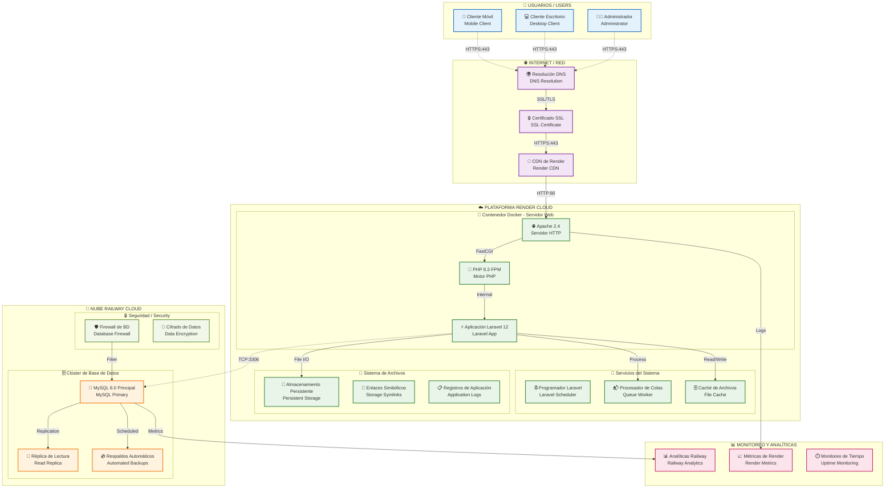
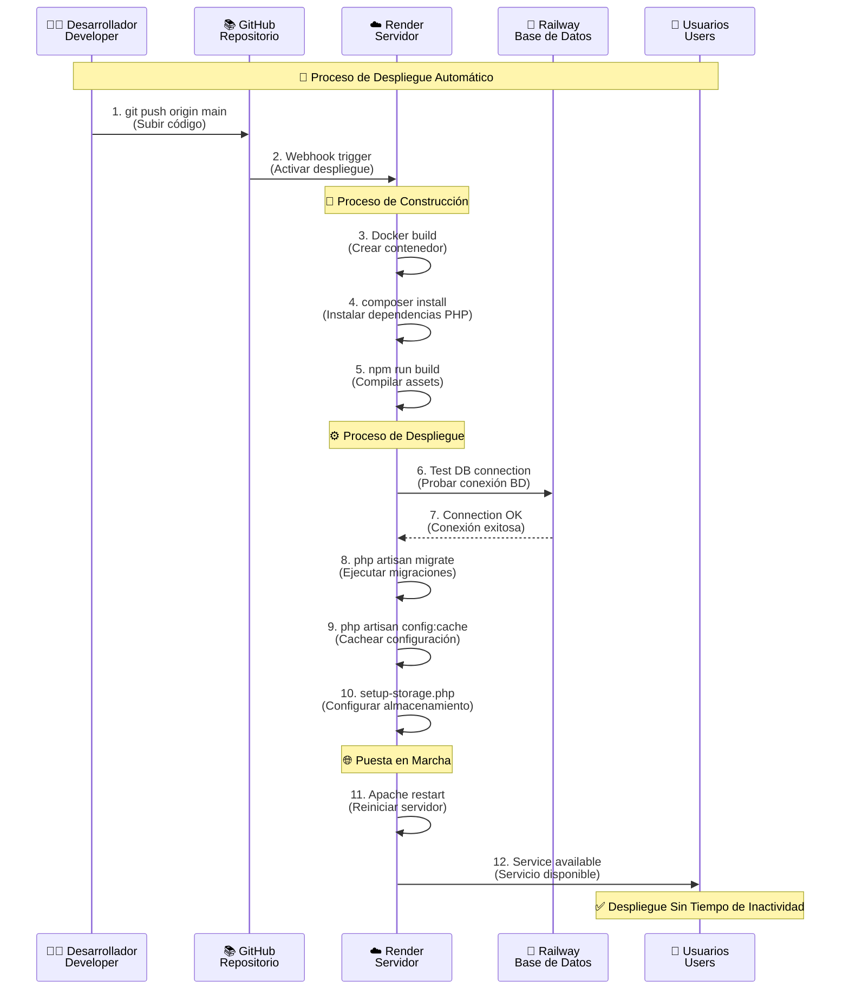
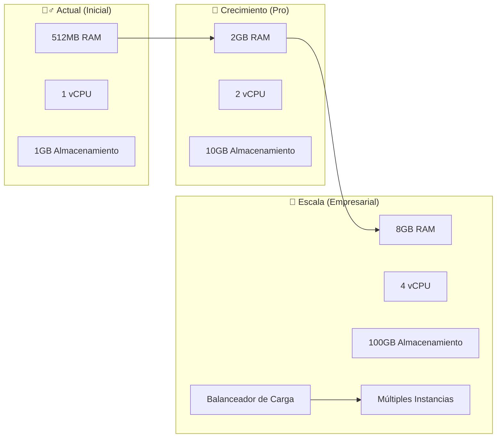

# 🌐 DIAGRAMA DE DESPLIEGUE COMPLETO - AGENCIA VASIR

## 🏗️ DIAGRAMA DE DESPLIEGUE (DEPLOYMENT DIAGRAM)



---

## 🏢 ESPECIFICACIONES TÉCNICAS DE DESPLIEGUE

### **☁️ NIVEL 1: FRONTEND Y SERVIDOR WEB (RENDER)**

| Componente | Especificación | Puerto | Protocolo |
|------------|----------------|--------|-----------|
| **Servidor Apache HTTP** | 2.4.x | 80, 443 | HTTP/HTTPS |
| **PHP-FPM** | 8.2 | 9000 | FastCGI |
| **Aplicación Laravel** | 12.x | Interno | PHP |
| **Recursos Estáticos** | Bundle Vite | 80 | HTTP |
| **Enlaces de Almacenamiento** | /storage → /app/public | Sistema de Archivos | - |

**Configuración del Servidor:**
```apache
# Configuración de Virtual Host de Apache
<VirtualHost *:80>
    ServerName vasir-agency-app.onrender.com
    DocumentRoot /var/www/html/public
    
    <Directory /var/www/html/public>
        AllowOverride All
        Require all granted
    </Directory>
    
    # Redireccionar HTTP a HTTPS
    RewriteEngine On
    RewriteCond %{HTTPS} off
    RewriteRule ^(.*)$ https://%{HOST}%1 [R=301,L]
</VirtualHost>

<VirtualHost *:443>
    ServerName vasir-agency-app.onrender.com
    DocumentRoot /var/www/html/public
    
    # Configuración SSL (Administrado por Render)
    SSLEngine on
    
    # Reescritura de URLs de Laravel
    <Directory /var/www/html/public>
        RewriteEngine On
        RewriteCond %{REQUEST_FILENAME} !-f
        RewriteCond %{REQUEST_FILENAME} !-d
        RewriteRule ^(.*)$ index.php [L]
    </Directory>
</VirtualHost>
```

### **🗄️ NIVEL 2: CAPA DE BASE DE DATOS (RAILWAY)**

| Componente | Especificación | Puerto | Protocolo |
|------------|----------------|--------|-----------|
| **MySQL Principal** | 8.0.x | 3306 | TCP/MySQL |
| **Pool de Conexiones** | Máx 100 conexiones | 3306 | TCP |
| **Cifrado SSL** | TLS 1.2+ | 3306 | TCP Cifrado |
| **Sistema de Respaldos** | Diario Automático | - | - |

**Configuración de Conexión:**
```env
# Configuración de Conexión a Base de Datos
DB_CONNECTION=mysql
DB_HOST=roundhouse.proxy.rlwy.net
DB_PORT=3306
DB_DATABASE=railway
DB_USERNAME=root
DB_PASSWORD=[CIFRADO]

# Configuración del Pool de Conexiones
DB_POOL_MIN=5
DB_POOL_MAX=20
DB_TIMEOUT=30
```

### **📁 NIVEL 3: CAPA DE ALMACENAMIENTO (DISCO PERSISTENTE RENDER)**

| Directorio | Propósito | Permisos | Respaldo |
|------------|-----------|----------|----------|
| `/storage/app/public/tours/` | Imágenes de tours | 775 | Incluido |
| `/storage/app/public/productos/` | Imágenes de productos | 775 | Incluido |
| `/storage/app/public/hoteles/` | Imágenes de hoteles | 775 | Incluido |
| `/storage/app/public/aerolinea/` | Imágenes de aerolíneas | 775 | Incluido |
| `/storage/logs/` | Registros de aplicación | 755 | Excluido |
| `/storage/framework/cache/` | Caché de aplicación | 755 | Excluido |

---

## 🔄 FLUJO DE DESPLIEGUE DETALLADO

### **PROCESO DE DESPLIEGUE AUTOMÁTICO / AUTOMATIC DEPLOYMENT**



### **CONFIGURACIÓN DE VARIABLES DE ENTORNO**

```bash
# Variables de Entorno de Producción
APP_NAME=VASIR
APP_ENV=production
APP_DEBUG=false
APP_URL=https://vasir-agency-app.onrender.com

# Configuración de Base de Datos
DB_CONNECTION=mysql
DB_HOST=roundhouse.proxy.rlwy.net
DB_PORT=3306
DB_DATABASE=railway
DB_USERNAME=root
DB_PASSWORD=[GENERADO_POR_RAILWAY]

# Configuración de Caché y Sesiones
CACHE_DRIVER=file
SESSION_DRIVER=database
QUEUE_CONNECTION=database

# Configuración de Almacenamiento
FILESYSTEM_DISK=public

# Seguridad
APP_KEY=[GENERADO_POR_LARAVEL]
BCRYPT_ROUNDS=12

# Configuración de Correo (Futuro)
MAIL_MAILER=smtp
MAIL_HOST=smtp.gmail.com
MAIL_PORT=587
```

---

## 🛡️ SEGURIDAD Y MONITOREO

### **MEDIDAS DE SEGURIDAD IMPLEMENTADAS**

```yaml
Seguridad de Red:
  - HTTPS obligatorio (SSL/TLS 1.2+)
  - Cabeceras de seguridad (HSTS, CSP)
  - Limitación de velocidad en endpoints API
  
Seguridad de Base de Datos:
  - Conexiones cifradas (SSL)
  - Firewall de Railway activo
  - Credenciales en variables de entorno
  
Seguridad de Aplicación:
  - Protección CSRF de Laravel
  - Autenticación Sanctum
  - Validación y sanitización de entradas
  - Sistema de permisos Spatie
```

### **MONITOREO Y ALERTAS**

```yaml
Monitoreo de Render:
  - Alertas de uso de CPU (>80%)
  - Alertas de uso de memoria (>80%)
  - Monitoreo de tiempo de respuesta
  - Seguimiento de tasa de errores

Monitoreo de Railway:
  - Monitoreo de conexiones de BD
  - Análisis de rendimiento de consultas
  - Seguimiento de uso de almacenamiento
  - Verificación de respaldos

Monitoreo de Aplicación:
  - Registro de errores de Laravel
  - Métricas de rendimiento
  - Seguimiento de actividad de usuarios
  - Verificaciones de salud del sistema
```

---

## 📈 ESCALABILIDAD Y PERFORMANCE

### **CONFIGURACIÓN ACTUAL**

| Recurso | Especificación | Límite | Escalabilidad |
|---------|----------------|--------|---------------|
| **CPU** | Shared vCPU | 1 core | Vertical scaling |
| **RAM** | 512MB | 1GB burst | Vertical scaling |
| **Storage** | 1GB persistent | 10GB max | Configurable |
| **Bandwidth** | 100GB/mes | 1TB available | Pay-as-grow |
| **Database** | Railway MySQL | 1GB storage | Horizontal scaling |

### **PLAN DE ESCALAMIENTO**



---

## 🔧 CONFIGURACIÓN DE PRODUCCIÓN

### **Docker Container Specifications**

```dockerfile
# Detalles del Contenedor de Producción
FROM php:8.2-apache

# Recursos del Sistema
ENV APACHE_MEMORY_LIMIT=256M
ENV PHP_MEMORY_LIMIT=512M
ENV PHP_MAX_EXECUTION_TIME=300
ENV PHP_UPLOAD_MAX_FILESIZE=10M

# Configuración de Apache
ENV APACHE_DOCUMENT_ROOT=/var/www/html/public
ENV APACHE_SERVER_NAME=vasir-agency-app.onrender.com

# Optimizaciones de Laravel
ENV APP_ENV=production
ENV APP_DEBUG=false
ENV LOG_LEVEL=error
```

### **Optimizaciones de Rendimiento**

```php
// config/app.php - Optimizaciones de producción
'providers' => [
    // Solo proveedores de servicios esenciales en producción
    App\Providers\AppServiceProvider::class,
    App\Providers\RouteServiceProvider::class,
    // Removidos: proveedores de debug innecesarios
],

// config/cache.php
'default' => 'file', // Caché rápido basado en archivos

// config/session.php  
'driver' => 'database', // Sesiones persistentes

// config/queue.php
'default' => 'database', // Procesamiento simple de colas
```

---

## ✅ CHECKLIST DE DESPLIEGUE

### **Pre-Deployment**
- [ ] ✅ Environment variables configuradas
- [ ] ✅ Database migrations tested
- [ ] ✅ Storage directories created
- [ ] ✅ SSL certificate verified
- [ ] ✅ DNS configuration confirmed

### **During Deployment**
- [ ] ✅ Zero-downtime deployment
- [ ] ✅ Database connectivity verified
- [ ] ✅ Storage symlinks created
- [ ] ✅ Cache cleared and rebuilt
- [ ] ✅ Application optimizations applied

### **Post-Deployment**
- [ ] ✅ Health check endpoints responding
- [ ] ✅ All features functional testing
- [ ] ✅ Performance metrics baseline
- [ ] ✅ Error monitoring active
- [ ] ✅ Backup systems verified

---

*Diagrama de Despliegue Completo - Agencia VASIR v1.0*  
*Actualizado: 12 octubre 2025*
