# 🌐 DIAGRAMA DE DESPLIEGUE COMPLETO - AGENCIA VASIR

## 🏗️ DIAGRAMA DE DESPLIEGUE (DEPLOYMENT DIAGRAM)

```mermaid
graph TB
    %% CAPA DE USUARIO
    subgraph "👥 USUARIOS"
        USER1[📱 Cliente Móvil]
        USER2[💻 Cliente Desktop]
        USER3[👨‍💼 Administrador]
    end

    %% CAPA DE RED/INTERNET
    subgraph "🌐 INTERNET"
        CDN[🚀 Render CDN]
        SSL[🔒 SSL Certificate]
        DNS[🌍 DNS Resolution]
    end

    %% CAPA DE APLICACIÓN (RENDER)
    subgraph "☁️ RENDER CLOUD PLATFORM"
        subgraph "🐳 Docker Container - Web Server"
            APACHE[🌐 Apache 2.4]
            PHP[🐘 PHP 8.2-FPM]
            LARAVEL[⚡ Laravel 12 App]
        end
        
        subgraph "📁 File System"
            STORAGE[💾 Persistent Storage]
            SYMLINK[🔗 Storage Symlinks]
            LOGS[📋 Application Logs]
        end
        
        subgraph "🔧 System Services"
            CRON[⏰ Laravel Scheduler]
            QUEUE[📬 Queue Worker]
            CACHE[🗄️ File Cache]
        end
    end

    %% CAPA DE BASE DE DATOS (RAILWAY)
    subgraph "🚄 RAILWAY CLOUD"
        subgraph "🗄️ Database Cluster"
            MYSQL[💾 MySQL 8.0 Primary]
            BACKUP[💿 Automated Backups]
            REPLICA[🔄 Read Replica]
        end
        
        subgraph "🔒 Security"
            FIREWALL[🛡️ Database Firewall]
            ENCRYPT[🔐 Data Encryption]
        end
    end

    %% CAPA DE MONITOREO
    subgraph "📊 MONITORING & ANALYTICS"
        RENDER_LOGS[📈 Render Metrics]
        RAILWAY_METRICS[📊 Railway Analytics]
        UPTIME[⏱️ Uptime Monitoring]
    end

    %% CONEXIONES CON PROTOCOLOS Y PUERTOS
    USER1 -.->|HTTPS:443| DNS
    USER2 -.->|HTTPS:443| DNS
    USER3 -.->|HTTPS:443| DNS
    
    DNS -->|SSL/TLS| SSL
    SSL -->|HTTPS:443| CDN
    CDN -->|HTTP:80| APACHE
    
    APACHE -->|FastCGI| PHP
    PHP -->|Internal| LARAVEL
    
    LARAVEL -.->|TCP:3306| MYSQL
    LARAVEL -->|File I/O| STORAGE
    LARAVEL -->|Process| QUEUE
    LARAVEL -->|Read/Write| CACHE
    
    MYSQL -->|Replication| REPLICA
    MYSQL -->|Scheduled| BACKUP
    FIREWALL -->|Filter| MYSQL
    
    APACHE -->|Logs| RENDER_LOGS
    MYSQL -->|Metrics| RAILWAY_METRICS
    
    %% CONFIGURACIÓN DE ESTILOS
    classDef user fill:#e3f2fd,stroke:#1565c0,stroke-width:2px
    classDef internet fill:#f3e5f5,stroke:#7b1fa2,stroke-width:2px
    classDef render fill:#e8f5e8,stroke:#2e7d32,stroke-width:2px
    classDef database fill:#fff3e0,stroke:#ef6c00,stroke-width:2px
    classDef monitoring fill:#fce4ec,stroke:#c2185b,stroke-width:2px
    classDef security fill:#f1f8e9,stroke:#558b2f,stroke-width:2px

    class USER1,USER2,USER3 user
    class CDN,SSL,DNS internet
    class APACHE,PHP,LARAVEL,STORAGE,SYMLINK,LOGS,CRON,QUEUE,CACHE render
    class MYSQL,BACKUP,REPLICA database
    class RENDER_LOGS,RAILWAY_METRICS,UPTIME monitoring
    class FIREWALL,ENCRYPT security
```



---

## 🏢 ESPECIFICACIONES TÉCNICAS DE DESPLIEGUE

### **☁️ TIER 1: FRONTEND & WEB SERVER (RENDER)**

| Componente | Especificación | Puerto | Protocolo |
|------------|----------------|--------|-----------|
| **Apache HTTP Server** | 2.4.x | 80, 443 | HTTP/HTTPS |
| **PHP-FPM** | 8.2 | 9000 | FastCGI |
| **Laravel Application** | 12.x | Internal | PHP |
| **Static Assets** | Vite Bundle | 80 | HTTP |
| **Storage Symlinks** | /storage → /app/public | File System | - |

**Configuración del Servidor:**
```apache
# Apache Virtual Host Configuration
<VirtualHost *:80>
    ServerName vasir-agency-app.onrender.com
    DocumentRoot /var/www/html/public
    
    <Directory /var/www/html/public>
        AllowOverride All
        Require all granted
    </Directory>
    
    # Redirect HTTP to HTTPS
    RewriteEngine On
    RewriteCond %{HTTPS} off
    RewriteRule ^(.*)$ https://%{HOST}%1 [R=301,L]
</VirtualHost>

<VirtualHost *:443>
    ServerName vasir-agency-app.onrender.com
    DocumentRoot /var/www/html/public
    
    # SSL Configuration (Managed by Render)
    SSLEngine on
    
    # Laravel URL Rewriting
    <Directory /var/www/html/public>
        RewriteEngine On
        RewriteCond %{REQUEST_FILENAME} !-f
        RewriteCond %{REQUEST_FILENAME} !-d
        RewriteRule ^(.*)$ index.php [L]
    </Directory>
</VirtualHost>
```

### **🗄️ TIER 2: DATABASE LAYER (RAILWAY)**

| Componente | Especificación | Puerto | Protocolo |
|------------|----------------|--------|-----------|
| **MySQL Primary** | 8.0.x | 3306 | TCP/MySQL |
| **Connection Pool** | Max 100 conexiones | 3306 | TCP |
| **SSL Encryption** | TLS 1.2+ | 3306 | Encrypted TCP |
| **Backup System** | Automated Daily | - | - |

**Configuración de Conexión:**
```env
# Database Connection Settings
DB_CONNECTION=mysql
DB_HOST=roundhouse.proxy.rlwy.net
DB_PORT=3306
DB_DATABASE=railway
DB_USERNAME=root
DB_PASSWORD=[ENCRYPTED]

# Connection Pool Settings
DB_POOL_MIN=5
DB_POOL_MAX=20
DB_TIMEOUT=30
```

### **📁 TIER 3: STORAGE LAYER (RENDER PERSISTENT DISK)**

| Directorio | Propósito | Permisos | Backup |
|------------|-----------|----------|---------|
| `/storage/app/public/tours/` | Imágenes de tours | 775 | Included |
| `/storage/app/public/productos/` | Imágenes de productos | 775 | Included |
| `/storage/app/public/hoteles/` | Imágenes de hoteles | 775 | Included |
| `/storage/app/public/aerolinea/` | Imágenes de aerolíneas | 775 | Included |
| `/storage/logs/` | Application logs | 755 | Excluded |
| `/storage/framework/cache/` | Application cache | 755 | Excluded |

---

## 🔄 FLUJO DE DESPLIEGUE DETALLADO

### **PROCESO DE DEPLOYMENT AUTOMÁTICO**

```mermaid
sequenceDiagram
    participant DEV as 👨‍💻 Developer
    participant GIT as 📚 GitHub
    participant RENDER as ☁️ Render
    participant RAILWAY as 🚄 Railway
    participant USERS as 👥 Users

    Note over DEV,USERS: 🚀 Proceso de Despliegue Automático

    DEV->>GIT: 1. git push origin main
    GIT->>RENDER: 2. Webhook trigger
    
    Note over RENDER: 🐳 Build Process
    RENDER->>RENDER: 3. Docker build
    RENDER->>RENDER: 4. composer install
    RENDER->>RENDER: 5. npm run build
    
    Note over RENDER: ⚙️ Deployment Process
    RENDER->>RAILWAY: 6. Test DB connection
    RAILWAY-->>RENDER: 7. Connection OK
    
    RENDER->>RENDER: 8. php artisan migrate
    RENDER->>RENDER: 9. php artisan config:cache
    RENDER->>RENDER: 10. setup-storage.php
    
    Note over RENDER: 🌐 Go Live
    RENDER->>RENDER: 11. Apache restart
    RENDER->>USERS: 12. Service available
    
    Note over USERS: ✅ Zero Downtime Deployment
```



### **CONFIGURACIÓN DE VARIABLES DE ENTORNO**

```bash
# Production Environment Variables
APP_NAME=VASIR
APP_ENV=production
APP_DEBUG=false
APP_URL=https://vasir-agency-app.onrender.com

# Database Configuration
DB_CONNECTION=mysql
DB_HOST=roundhouse.proxy.rlwy.net
DB_PORT=3306
DB_DATABASE=railway
DB_USERNAME=root
DB_PASSWORD=[RAILWAY_GENERATED]

# Cache & Session Configuration
CACHE_DRIVER=file
SESSION_DRIVER=database
QUEUE_CONNECTION=database

# Storage Configuration
FILESYSTEM_DISK=public

# Security
APP_KEY=[LARAVEL_GENERATED]
BCRYPT_ROUNDS=12

# Mail Configuration (Future)
MAIL_MAILER=smtp
MAIL_HOST=smtp.gmail.com
MAIL_PORT=587
```

---

## 🛡️ SEGURIDAD Y MONITOREO

### **MEDIDAS DE SEGURIDAD IMPLEMENTADAS**

```yaml
Network Security:
  - HTTPS obligatorio (SSL/TLS 1.2+)
  - Headers de seguridad (HSTS, CSP)
  - Rate limiting en API endpoints
  
Database Security:
  - Conexiones encriptadas (SSL)
  - Firewall de Railway activo
  - Credenciales en variables de entorno
  
Application Security:
  - Laravel CSRF protection
  - Sanctum authentication
  - Input validation & sanitization
  - Spatie permissions system
```

### **MONITOREO Y ALERTAS**

```yaml
Render Monitoring:
  - CPU usage alerts (>80%)
  - Memory usage alerts (>80%)
  - Response time monitoring
  - Error rate tracking

Railway Monitoring:
  - Database connection monitoring
  - Query performance analysis
  - Storage usage tracking
  - Backup verification

Application Monitoring:
  - Laravel error logging
  - Performance metrics
  - User activity tracking
  - System health checks
```

---

## 📈 ESCALABILIDAD Y PERFORMANCE

### **CONFIGURACIÓN ACTUAL**

| Recurso | Especificación | Límite | Escalabilidad |
|---------|----------------|--------|---------------|
| **CPU** | Shared vCPU | 1 core | Vertical scaling |
| **RAM** | 512MB | 1GB burst | Vertical scaling |
| **Storage** | 1GB persistent | 10GB max | Configurable |
| **Bandwidth** | 100GB/mes | 1TB available | Pay-as-grow |
| **Database** | Railway MySQL | 1GB storage | Horizontal scaling |

### **PLAN DE ESCALAMIENTO**

```mermaid
graph LR
    subgraph "🏃‍♂️ Current (Starter)"
        C1[512MB RAM]
        C2[1 vCPU]
        C3[1GB Storage]
    end
    
    subgraph "🚀 Growth (Pro)"
        G1[2GB RAM]
        G2[2 vCPU]
        G3[10GB Storage]
    end
    
    subgraph "🏢 Scale (Enterprise)"
        E1[8GB RAM]
        E2[4 vCPU]
        E3[100GB Storage]
        E4[Load Balancer]
        E5[Multiple Instances]
    end
    
    C1 --> G1
    G1 --> E1
    E4 --> E5
```



---

## 🔧 CONFIGURACIÓN DE PRODUCCIÓN

### **Docker Container Specifications**

```dockerfile
# Production Container Details
FROM php:8.2-apache

# System Resources
ENV APACHE_MEMORY_LIMIT=256M
ENV PHP_MEMORY_LIMIT=512M
ENV PHP_MAX_EXECUTION_TIME=300
ENV PHP_UPLOAD_MAX_FILESIZE=10M

# Apache Configuration
ENV APACHE_DOCUMENT_ROOT=/var/www/html/public
ENV APACHE_SERVER_NAME=vasir-agency-app.onrender.com

# Laravel Optimizations
ENV APP_ENV=production
ENV APP_DEBUG=false
ENV LOG_LEVEL=error
```

### **Performance Optimizations**

```php
// config/app.php - Production optimizations
'providers' => [
    // Only essential service providers in production
    App\Providers\AppServiceProvider::class,
    App\Providers\RouteServiceProvider::class,
    // Removed: unnecessary debug providers
],

// config/cache.php
'default' => 'file', // Fast file-based caching

// config/session.php  
'driver' => 'database', // Persistent sessions

// config/queue.php
'default' => 'database', // Simple queue processing
```

---

## ✅ CHECKLIST DE DESPLIEGUE

### **Pre-Deployment**
- [ ] ✅ Environment variables configuradas
- [ ] ✅ Database migrations tested
- [ ] ✅ Storage directories created
- [ ] ✅ SSL certificate verified
- [ ] ✅ DNS configuration confirmed

### **During Deployment**
- [ ] ✅ Zero-downtime deployment
- [ ] ✅ Database connectivity verified
- [ ] ✅ Storage symlinks created
- [ ] ✅ Cache cleared and rebuilt
- [ ] ✅ Application optimizations applied

### **Post-Deployment**
- [ ] ✅ Health check endpoints responding
- [ ] ✅ All features functional testing
- [ ] ✅ Performance metrics baseline
- [ ] ✅ Error monitoring active
- [ ] ✅ Backup systems verified

---

*Diagrama de Despliegue Completo - Agencia VASIR v1.0*  
*Actualizado: 12 octubre 2025*
