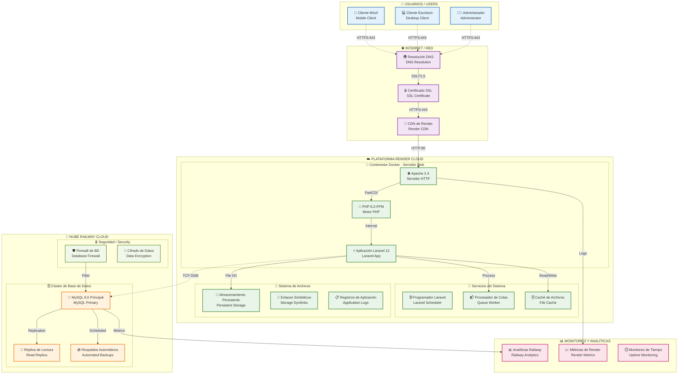

```mermaid
graph TB
    %% CAPA DE USUARIO
    subgraph "👥 USUARIOS / USERS"
        USER1[📱 Cliente Móvil<br/>Mobile Client]
        USER2[💻 Cliente Escritorio<br/>Desktop Client]
        USER3[👨‍💼 Administrador<br/>Administrator]
    end

    %% CAPA DE RED/INTERNET
    subgraph "🌐 INTERNET / RED"
        CDN[🚀 CDN de Render<br/>Render CDN]
        SSL[🔒 Certificado SSL<br/>SSL Certificate]
        DNS[🌍 Resolución DNS<br/>DNS Resolution]
    end

    %% CAPA DE APLICACIÓN (RENDER)
    subgraph "☁️ PLATAFORMA RENDER CLOUD"
        subgraph "🐳 Contenedor Docker - Servidor Web"
            APACHE[🌐 Apache 2.4<br/>Servidor HTTP]
            PHP[🐘 PHP 8.2-FPM<br/>Motor PHP]
            LARAVEL[⚡ Aplicación Laravel 12<br/>Laravel App]
        end
        
        subgraph "📁 Sistema de Archivos"
            STORAGE[💾 Almacenamiento Persistente<br/>Persistent Storage]
            SYMLINK[🔗 Enlaces Simbólicos<br/>Storage Symlinks]
            LOGS[📋 Registros de Aplicación<br/>Application Logs]
        end
        
        subgraph "🔧 Servicios del Sistema"
            CRON[⏰ Programador Laravel<br/>Laravel Scheduler]
            QUEUE[📬 Procesador de Colas<br/>Queue Worker]
            CACHE[🗄️ Caché de Archivos<br/>File Cache]
        end
    end

    %% CAPA DE BASE DE DATOS (RAILWAY)
    subgraph "🚄 NUBE RAILWAY CLOUD"
        subgraph "🗄️ Clúster de Base de Datos"
            MYSQL[💾 MySQL 8.0 Principal<br/>MySQL Primary]
            BACKUP[💿 Respaldos Automáticos<br/>Automated Backups]
            REPLICA[🔄 Réplica de Lectura<br/>Read Replica]
        end
        
        subgraph "🔒 Seguridad / Security"
            FIREWALL[🛡️ Firewall de BD<br/>Database Firewall]
            ENCRYPT[🔐 Cifrado de Datos<br/>Data Encryption]
        end
    end

    %% CAPA DE MONITOREO
    subgraph "📊 MONITOREO Y ANALÍTICAS"
        RENDER_LOGS[📈 Métricas de Render<br/>Render Metrics]
        RAILWAY_METRICS[📊 Analíticas Railway<br/>Railway Analytics]
        UPTIME[⏱️ Monitoreo de Tiempo<br/>Uptime Monitoring]
    end

    %% CONEXIONES CON PROTOCOLOS Y PUERTOS
    USER1 -.->|HTTPS:443| DNS
    USER2 -.->|HTTPS:443| DNS
    USER3 -.->|HTTPS:443| DNS
    
    DNS -->|SSL/TLS| SSL
    SSL -->|HTTPS:443| CDN
    CDN -->|HTTP:80| APACHE
    
    APACHE -->|FastCGI| PHP
    PHP -->|Internal| LARAVEL
    
    LARAVEL -.->|TCP:3306| MYSQL
    LARAVEL -->|File I/O| STORAGE
    LARAVEL -->|Process| QUEUE
    LARAVEL -->|Read/Write| CACHE
    
    MYSQL -->|Replication| REPLICA
    MYSQL -->|Scheduled| BACKUP
    FIREWALL -->|Filter| MYSQL
    
    APACHE -->|Logs| RENDER_LOGS
    MYSQL -->|Metrics| RAILWAY_METRICS
    
    %% CONFIGURACIÓN DE ESTILOS
    classDef user fill:#e3f2fd,stroke:#1565c0,stroke-width:2px
    classDef internet fill:#f3e5f5,stroke:#7b1fa2,stroke-width:2px
    classDef render fill:#e8f5e8,stroke:#2e7d32,stroke-width:2px
    classDef database fill:#fff3e0,stroke:#ef6c00,stroke-width:2px
    classDef monitoring fill:#fce4ec,stroke:#c2185b,stroke-width:2px
    classDef security fill:#f1f8e9,stroke:#558b2f,stroke-width:2px

    class USER1,USER2,USER3 user
    class CDN,SSL,DNS internet
    class APACHE,PHP,LARAVEL,STORAGE,SYMLINK,LOGS,CRON,QUEUE,CACHE render
    class MYSQL,BACKUP,REPLICA database
    class RENDER_LOGS,RAILWAY_METRICS,UPTIME monitoring
    class FIREWALL,ENCRYPT security
```
